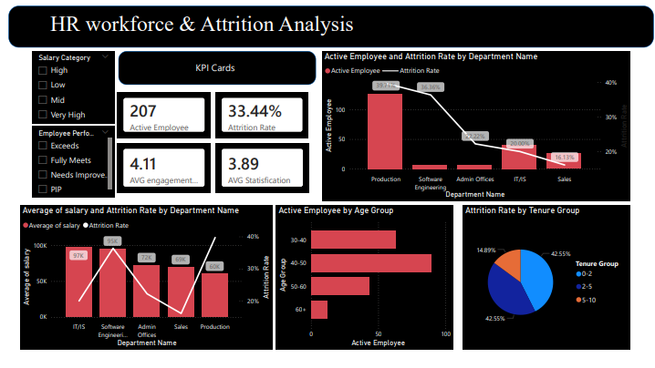

# HR Analytics: Data Warehouse & Attrition Analysis

## 📌 Overview

This project builds an end-to-end HR analytics pipeline, covering data extraction, transformation, data warehouse modeling, and interactive dashboard visualization.

The primary objective is to analyze employee attrition and identify key drivers behind workforce turnover to support better HR decision-making.

---

## 🎯 Objectives

* Understand workforce composition across departments
* Identify patterns and drivers of employee attrition
* Analyze relationships between compensation, engagement, and retention
* Provide actionable business recommendations

---

## ⚙️ Tech Stack

* **Python**: pandas, psycopg2
* **Database**: PostgreSQL (Data Warehouse)
* **Visualization**: Power BI

---

## 🏗️ Data Architecture

This project uses a **Star Schema** design:

### Fact Table

* `fact_employee`

### Dimension Tables

* `dim_department`
* `dim_age_group`
* `dim_tenure_group`
* `dim_performance`

---

## 🔄 ETL Pipeline

### 1. Extract

* Load HR dataset from CSV

### 2. Transform

* Clean inconsistent and duplicate IDs
* Handle missing values (e.g., manager ID mapping)
* Standardize department and position data
* Create derived features:

  * Age & Age Group
  * Tenure & Tenure Group
* Ensure consistent dimension keys

### 3. Initial Load

* Load transformed data into PostgreSQL warehouse
* Populate fact and dimension tables

---

## 📊 Dashboard

The Power BI dashboard provides:

* Workforce overview (headcount, salary, satisfaction)
* Attrition analysis by department and tenure
* Relationship between project involvement and salary
* Department-level comparison (salary, satisfaction, performance)

### Dashboard Preview



---

## 🔍 Key Insights

* **Production department** has the highest attrition rate while also having the largest workforce, making it the most critical risk area
* **Early-tenure employees (0–5 years)** contribute the most to attrition
* Employees with higher **project involvement tend to have higher salaries**, but project participation alone does not explain retention differences
* Attrition appears to be driven more by **department-specific factors** such as job conditions and compensation rather than project assignment

---

## 🚀 Recommendations

* Focus retention strategies on the **Production department**
* Improve **onboarding and early employee support** to reduce early attrition
* Review **compensation and working conditions** in operational roles
* Use engagement initiatives (e.g., projects) strategically to support employee development
* Monitor high-risk employee segments using data-driven tracking

---

## ⚠️ Limitations

* Analysis is based on **snapshot data** (no time-series trends)
* Small departments may produce **unstable attrition rates**
* Cannot fully establish causation (only observed relationships)

---

## ▶️ How to Run

1. Configure database connection in:

   ```
   src/config.py
   ```

2. Create database:

   ```
   python src/setup.py
   ```

3. Run DDL (create tables):

   ```
   python src/ddl.py
   ```

4. Run ETL pipeline:

   ```
   python src/load.py
   ```

---

## 📂 Project Structure

```
hr-analytics-warehouse/
│
├── data/
│   ├── raw/
│   ├── processed/
│
├── src/
│   ├── extract.py
│   ├── transform.py
│   ├── load.py
│   ├── initial load.py
│   ├── ddl.py
│   ├── setup.py
│   ├── config.py
│
├── dashboard/
│   ├── hr_dashboard.pbix
│   ├── dashboard_preview.png
│
├── analysis/
│   ├── analysis_deck.pdf
│
├── images/
│   ├── dashboard.png
│
├── requirements.txt
├── README.md
```

---

## 📈 Future Improvements

* Add time-based analysis (monthly attrition trends)
* Build automated data pipeline (scheduled ETL)
* Enhance dashboard with drill-through analysis
* Integrate machine learning for attrition prediction

---

## 👤 Author

This project was developed as part of a data analytics and data engineering portfolio project.
